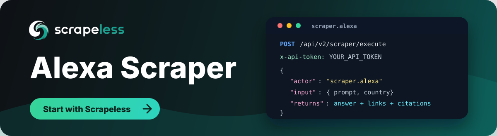

# Alexa Scraper

<p align="center">
  <a href="https://app.scrapeless.com/passport/login?redirect=/quick-start&utm_source=github&utm_medium=repo&utm_campaign=alexa_scraper" target="_blank">
    
  </a>
</p>

<p align="center">
  <a href="https://app.scrapeless.com/passport/login?redirect=/quick-start&utm_source=github&utm_medium=repo&utm_campaign=alexa_scraper">
    
  </a>
  <a href="https://www.scrapeless.com/en/blog?utm_source=github&utm_medium=repo&utm_campaign=alexa_scraper">
    
  </a>
  <a href="https://x.com/Scrapelessteam">
    
  </a>
  <a href="https://www.linkedin.com/company/scrapeless/">
    
  </a>
</p>

Collect Amazon Alexa answers through the **Scrapeless LLM Chat Scraper** API, including the Markdown and plain-text response, citations, source links, follow-up suggestions, and shopping product cards, without reverse-engineering the Alexa app, maintaining browsers, or building your own anti-blocking stack.

Use this repo when you need a repeatable way to monitor Alexa answers for GEO and AI search visibility, compare prompts across markets, audit cited sources and recommended products, or pipe AI responses into analytics and automation workflows.

- [**Full documentation**] (https://docs.scrapeless.com/en/llm-chat-scraper/quickstart/introduction/)
- [**Get your `x-api-token`**] (https://app.scrapeless.com/passport/login?redirect=/quick-start&utm_source=github&utm_medium=repo&utm_campaign=alexa_scraper)
- **API endpoint:** `POST https://api.scrapeless.com/api/v2/scraper/execute`

## How it works

Send a single `POST` request to the Scrapeless endpoint with your API token in
the `x-api-token` header. The body specifies the actor (`scraper.alexa`) and
an `input` object with your prompt and options. The API runs the query and
returns the structured result in `task_result`.

```http
POST https://api.scrapeless.com/api/v2/scraper/execute
Content-Type: application/json
x-api-token: <YOUR_API_TOKEN>
```

## Quick start (curl)

```bash
curl 'https://api.scrapeless.com/api/v2/scraper/execute' \
  --header 'Content-Type: application/json' \
  --header 'x-api-token: YOUR_API_TOKEN' \
  --data '{
    "actor": "scraper.alexa",
    "input": {
      "prompt": "Recommended attractions in New York",
      "country": "US"
    }
  }'
```

To receive the result asynchronously, add a `webhook` object:

```json
"webhook": { "url": "https://www.your-webhook.com" }
```

## Request parameters

The request body has three top-level fields: `actor` (always `scraper.alexa`),
`input` (below), and an optional `webhook`.

| Parameter (`input.*`) | Type   | Required | Description                              |
| --------------------- | ------ | -------- | ---------------------------------------- |
| `prompt`              | string | Yes      | Prompt to send to Alexa.                 |
| `country`             | string | Yes      | Country / region code (e.g. `US`, `JP`). |

## Response

A successful call returns a status envelope; the scraped data lives in
`task_result`:

```json
{
  "status": "success",
  "task_id": "e705743d-da2e-4163-9ccd-eef62529ff72",
  "task_result": {
    "user_text": "Recommended attractions in New York",
    "md_text": "...markdown answer...",
    "raw_text": "...plain-text answer...",
    "completed": true,
    "conversation": { "id": "..." },
    "references": [
      { "id": "cite_NWXekzs", "title": "...", "url": "https://..." }
    ],
    "sources": [
      { "text": "example.com", "url": "https://...", "type": "OpenURL" }
    ],
    "suggestions": [
      { "text": "...", "message": "...", "type": "TextMessage" }
    ],
    "products": [
      {
        "product_id": "B0...",
        "title": "...",
        "price": "$989.95",
        "url": "https://...",
        "image_url": "https://..."
      }
    ]
  }
}
```

### Top-level fields

| Field         | Type   | Description                     |
| ------------- | ------ | ------------------------------- |
| `status`      | string | Request status, e.g. `success`. |
| `task_id`     | string | Unique identifier for the task. |
| `task_result` | object | Scraped result (fields below).  |

### `task_result` fields

| Field                   | Type   | Description                                              |
| ----------------------- | ------ | -------------------------------------------------------- |
| `user_text`             | string | The original text sent by the user.                     |
| `md_text`               | string | Markdown-formatted answer from Alexa.                   |
| `raw_text`              | string | Plain-text answer from Alexa.                           |
| `completed`             | bool   | Whether answer generation has finished.                 |
| `answer_fragment_uri`   | string | URI of the answer fragment.                             |
| `answer_revision`       | int    | Revision number of the answer.                          |
| `dialog_request_id`     | string | Identifier of the dialog request.                       |
| `endpoint_id`           | string | Identifier of the responding endpoint/device.           |
| `fragment_count`        | int    | Number of response fragments.                           |
| `conversation`          | object | Conversation context (`conversation.id`).               |
| `directives`            | array  | Processing directives emitted during the interaction.   |
| `references`            | array  | Citations referenced in the answer (`id`, `title`, `url`). |
| `sources`               | array  | Source links backing the answer (`text`, `url`, `type`, `fragment_uri`). |
| `suggestions`           | array  | Suggested follow-up prompts (`text`, `message`, `type`, `fragment_uri`). |
| `products`              | array  | Product cards returned by Alexa (empty when not applicable). |
| `products.product_id`   | string | Product identifier, e.g. an Amazon ASIN.                |
| `products.title`        | string | Product title.                                          |
| `products.price`        | string | Display price, e.g. `$989.95`.                          |
| `products.delivery`     | string | Delivery information, e.g. `Delivery by Tuesday, July 7`. |
| `products.image_url`    | string | Product image URL.                                      |
| `products.url`          | string | Product page URL.                                       |

For the complete field list (nested directive, source, suggestion, and product
attributes), see the [official documentation](https://docs.scrapeless.com/en/llm-chat-scraper/quickstart/introduction/&utm_source=github&utm_medium=repo&utm_campaign=alexa_scraper)
and [`api.md`](./api.md).

## Code examples

Ready-to-run examples live in [`examples/`](./examples):

| Language | File                                       | Run                                   |
| -------- | ------------------------------------------ | ------------------------------------- |
| Python   | [`example.py`](./examples/example.py)      | `pip install requests && python example.py` |
| Node.js  | [`example.js`](./examples/example.js)      | `node example.js` (Node 18+)          |
| Go       | [`example.go`](./examples/example.go)      | `go run example.go`                   |
| Java     | [`Example.java`](./examples/Example.java)  | `java Example.java` (Java 11+)        |
| PHP      | [`example.php`](./examples/example.php)    | `php example.php`                     |

All examples read the token from the `SCRAPELESS_API_TOKEN` environment variable:

```bash
export SCRAPELESS_API_TOKEN="your_api_token"
```

## Practical use cases

### AI answer monitoring

Track how Alexa responds to your brand, product category, documentation topics, or competitor prompts. Store the Markdown answer, citations, sources, and product cards so your team can measure AI visibility over time.

### GEO and SEO research

Run the same prompt across countries to compare which sources Alexa cites, how recommendations change by region, and where your content appears in AI-generated answers.

### Competitor intelligence

Collect structured Alexa answers for competitor names, feature comparisons, pricing questions, and "best tool for..." prompts. Use the output, including recommended products, to identify messaging gaps and content opportunities.

### Dataset and workflow automation

Pipe Alexa answers into internal dashboards, knowledge-base QA systems, spreadsheets, data warehouses, or alerting workflows through the synchronous API response or webhook callback.

## Why use Scrapeless for Alexa scraping?

| Benefit | What it means for your team |
| ------- | --------------------------- |
| One unified API | Query Alexa through the same Scrapeless LLM Chat Scraper workflow used for other AI answer engines. |
| Structured output | Receive Markdown and plain-text answers, citations, source links, follow-up suggestions, and shopping product cards in a developer-friendly response. |
| Less maintenance | Avoid building browser automation, UI selectors, proxy rotation, retries, and anti-blocking logic yourself. |
| Region-aware analysis | Use country inputs to compare localized AI answers and source citations. |
| Production integration | Use API tokens, webhooks, and language examples to connect Alexa data to real applications quickly. |

## FAQ

### What is Alexa Scraper?

Alexa Scraper is a Scrapeless LLM Chat Scraper actor that sends prompts to Amazon Alexa and returns structured answer data, including the Markdown and plain-text response, citations, source links, follow-up suggestions, and product cards.

### Do I need to run a browser or proxy pool?

No. This repo shows how to call the Scrapeless API. Scrapeless handles the scraping workflow behind the API, so your application only needs to send requests and process the returned data.

### What data does Alexa Scraper return?

Each successful call returns `md_text` and `raw_text` (the answer from Alexa), the original `user_text`, and arrays of `references`, `sources`, `suggestions`, and `products`. Citations and sources include titles and URLs so you can audit and attribute the sources Alexa used.

### Can I get results asynchronously?

Yes. Add a `webhook` object with your callback URL to receive results asynchronously when the task completes.

### Is this suitable for AI search visibility monitoring?

Yes. The response includes AI-generated Markdown, structured citations, and source links, which makes it useful for GEO analysis, brand monitoring, source tracking, and competitive research.

### What should I consider before using AI scraping in production?

Make sure your use case complies with applicable laws, platform terms, privacy requirements, and your organization's data policies. Avoid collecting sensitive, private, or unauthorized information.

## Learn more

- [Scrapeless LLM Chat Scraper documentation](https://docs.scrapeless.com/en/llm-chat-scraper/quickstart/introduction/)
- [Supported LLM Chat Scraper actors](https://docs.scrapeless.com/en/llm-chat-scraper/quickstart/introduction/)
- [Scrapeless dashboard](https://app.scrapeless.com/passport/login?redirect=/quick-start&utm_source=github&utm_medium=repo&utm_campaign=alexa_scraper)
- [Scrapeless website](https://www.scrapeless.com/en/?utm_source=github&utm_medium=repo&utm_campaign=alexa_scraper)

## Contact us

Need help building an Alexa monitoring workflow or scaling AI answer collection?

- Join our [Discord](https://discord.gg/VU2vtbq7Q2).
- Contact us on [Telegram](https://t.me/scrapeless).
- For repo-specific issues or improvements, open an issue or pull request in this repository.
